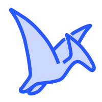

# FRKN Dopamine - VPN Client based on AmneziaVPN

    
    <strong>We support freedom of speech and oppose all forms of censorship. We are developing a decentralized VPN that does not collect or store user data.</strong>

 

## Links

- 🌐 [https://frkn.org](https://frkn.org) - project website
- 📢 [https://t.me/frkn_org](https://t.me/FRKN_org) - telegram channel
- 🛠️ [https://t.me/frkn_support](https://t.me/frkn_support) - telegram support
- 💻 [https://t.me/frkn_dev](https://t.me/frkn_dev) - telegram dev chat
- 🛍️ [https://shop.frkn.org/](https://shop.frkn.org/catalogue/frkn) - FRKN merch

## For tech buddies
Since FRKN client based on [Amnezia](https://github.com/amnezia-vpn/amnezia-client), you can just contribute directly there.

## License
[GPL v3.0](LICENSE)
